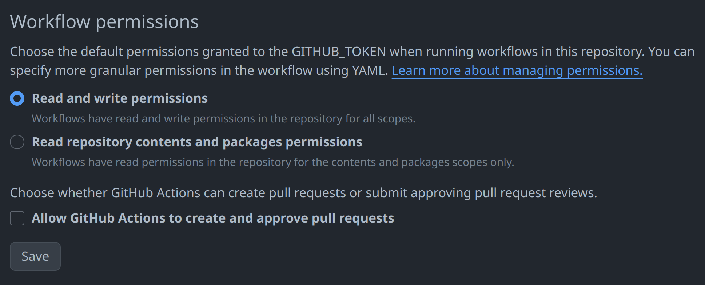

# GitHub Automerge

GitHub action that automatically merges a branch into another branch on push. This is useful, for example, if you want to deploy the same code using different environment variables on Vercel.

Copy and modify `.github/workflows/automerge.yml` for your purposes.

Make sure your repository is configured such that workflows have "read and write permissions":

